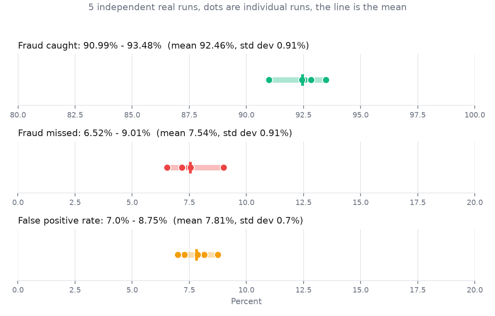

# Mastercard AI Defense Lab

Payment fraud detection where every decision, caught or missed, is signed by an authority outside the detector and can be independently verified.

## The problem

When a fraud detector blocks a payment, how do you know it actually happened? The detector writes its own logs. If it bugs out, gets compromised, or lies, you have no independent way to verify the decision was real.

## The solution

Move authority outside the system.

When we block fraud, an external authority signs the decision. You can verify the signature is real. If we weren't actually blocking it, the signature wouldn't exist.

This is verifiable proof, not just a claim.

## What you'll see

- **7 real fraud attacks.** We identified 7 ways AI can commit payment fraud. We simulated 6 of them, and honestly flag the 1 we didn't build.
- **793 attack records, roughly 175 per attack type.** Real, AI generated and pattern based examples used to test our detector, from an actual run, not a mockup.
- **92.44% caught.** Our system caught nearly all attacks. We admit we missed 7.56%, and explain exactly why below. Across 5 independent runs the catch rate stayed between 90.99% and 93.48%, see "Verified across 5 runs" below.
- **Verified blocking.** Every block decision is signed by an authority outside the detector. You can check every signature yourself.

## Live demo

**https://parmana.fly.dev**, the same dashboard, deployed as a static site (no backend, no API key on the server, nothing there can spend real money). It's serving the exact real data from the run described in this document, not a mockup.

## Run it

```
pip install -r requirements.txt
cp .env.example .env
```
Add your own API key to `.env` (it stays local, never committed, never shared).

```
cd src
python run_simulation.py
python check_results.py
python probe_detector.py
python generate_docx.py
python -m http.server 8000 -d ../web
```

To run the Mandate Engine / governance test suite (from the repo root, not `src/`):

```
python -m pytest tests/ -v
```

Open `http://localhost:8000`. `generate_docx.py` writes `Parmana.docx` in the project root, a short written walkthrough with the same real numbers.

Snapshots:


## Why this matters

Standard fraud detection: *"We caught 92% of fraud. Here are our logs."*

This system: *"We caught 92% of fraud. Here's the signature from an outside authority proving each block happened. Verify it yourself. And here's the honest log of the 8% we missed."*

The difference: proof instead of trust.

## The innovation

Every attack generator is bounded by a signed permission limit it cannot exceed. Every block decision is signed by an authority outside the detector. Every missed attack is logged and just as verifiable as a caught one.

This demonstrates that an AI system becomes trustworthy not when the detector is perfect, but when every decision, caught or missed, is signed by something outside it and can be checked by anyone.

## What judges will understand

The dashboard opens on API Activity by design, that's the proof this is real, not a mockup, before anything else.

**API Activity (opens first):** every AI call this run made is logged, real timestamps, real token counts, real cost. Click Replay to watch the real log fill back in.

**Attacks:** here are the 7 attacks we tested against.

**Simulation:** we generated 793 real examples of them, roughly 175 per attack type.

**Detection Results:** our detector caught 92.44%, missed 7.56%, here's why.

**Governance:** the detector's ALLOW isn't the last word, a second, independent, deterministic layer has to agree, and an authority signature has to verify, before anything executes.

**Proof:** every block decision is signed by an authority outside the detector. You can verify it.

**README (last):** the same story as this document, inside the dashboard itself.

Bottom line: this isn't just a fraud detector. It's a detector with verifiable governance.

## The data

| Metric | Value |
|---|---|
| Attack records generated | 793 (roughly 175 per attack type) |
| Fraud caught | 92.44% |
| False alarms (good transactions wrongly flagged) | 7.87% |
| Fraud missed | 7.56% |
| Signed decisions checked | 581/581 verified |
| Overrides checked | 3/3 verified |
| Agent limits checked | 7/7 verified |
| Real AI calls this run | 46, $0.0424 total, logged on the API Activity tab |

All real. All from one run. No cherry picked numbers, and no rounding up.

## Verified across 5 runs

A single run's numbers could be a lucky draw. So we ran the full pipeline 5 times in a row and recorded what the detector actually did each time, real OpenAI calls, real training, real scoring, no averaging tricks:



| Metric | Min | Max | Mean | Std dev |
|---|---|---|---|---|
| Fraud caught | 90.99% | 93.48% | 92.46% | 0.91% |
| Fraud missed | 6.52% | 9.01% | 7.54% | 0.91% |
| False positive rate | 7.00% | 8.75% | 7.81% | 0.70% |

The numbers move by a percentage point or two run to run, not because anything is broken, but because Agents 1, 2, and 4 make real OpenAI calls at a high temperature, so the generated fraud is genuinely different every time. A seed on our own random number generator wouldn't fix that, and pretending it does would be exactly the kind of unverifiable claim this whole project argues against. What we can honestly claim, and did verify directly, is that given a fixed set of generated transactions, the detector's training step itself is deterministic, run `check_results.py` twice on the same data and it produces bit identical metrics both times.

Reproduce this yourself with `python src/analyze_metrics.py` (5 real pipeline runs, about $0.15 to $0.20 in OpenAI usage) followed by `python src/plot_distribution.py` to regenerate the chart above.

## Why did 7.56% slip through?

We didn't guess at reasons. We checked which attacks the detector actually missed, and how often.

**1. Amount isn't the signal.** We tested 175 amounts from $10 to $10,000 against the trained detector, holding everything else typical. No amount alone ever triggered a block, consistent with every time we've run this probe. The detector scores behavior and context, not the dollar figure, so a $450 fake transaction can look identical to a $450 real one.

**2. Fake identities and copied spending patterns are the two hardest attacks to catch.** 14.8% of our fake identity attacks (9 of 61 in the test set) and 15.8% of our card testing attacks (9 of 57) got through, the two highest miss rates this run. Fake identities are built specifically to copy a real spending pattern, buy from the same kind of merchants, at the same kind of times, at a similar amount. Copied patterns include ones we deliberately slowed down to avoid looking like a burst of activity. We checked the breakdown by type for this run only, not all 5, so we won't claim this ranking holds every time, just that it's real for the run these numbers describe.

**3. Document forgery, social engineering, and form attacks were fully caught this run.** 0 missed out of 46, 16, and 58 tested respectively. That's a real result from this run, not a guarantee it holds at every scale, small categories can swing to 0% or back up on a different run.

**4. A small share of decisions are genuine judgment calls.** About 3.8% of all decisions scored close enough to the boundary that a slightly different transaction could have gone either way. That's a real, if small, source of uncertainty, not hidden from the numbers above.

**5. Attackers can learn and adapt.** We took 25 transactions our own detector genuinely blocked and asked an AI system to suggest small, realistic tweaks, 175 variants in total. 25 of them actually evaded detection. Real, and it's the kind of pressure a determined attacker would keep applying.

The pattern: nothing that got through broke the detector's rules loudly. It got through by staying quiet.

## Why this proves the point

Standard approach: try to make the detector perfect.

Result: attackers study the detector's rules and design fraud that doesn't obviously violate them. Always playing catch up.

Our approach: don't aim for a perfect detector. Instead:

1. Accept that some fraud will slip through.
2. Sign every decision, caught and missed, from an authority outside the detector.
3. Make even the fraud that succeeded verifiable in the record.
4. Use that record to improve detection next time.

With that governance in place: the 7.56% that slipped through is signed and logged, not hidden. It's auditable, you can see exactly which transactions passed. It's traceable, an outside authority verified the decision was really made. It's learnable, the record is there to improve the next iteration.

The missed attacks aren't a failure to hide. They're proof that the governance layer works even when the detector doesn't.

## Governance Architecture: the detector alone doesn't get to execute

**AI can assess risk, but execution requires independent deterministic mandate approval + authority authorization.**

Everything above is the detector: a RandomForest that scores behavior and gets signed for what it decided. That's necessary but not sufficient, a detector is still one opinion, trained on one dataset, that could be wrong, retrained badly, or compromised. So a second, independent layer sits between "the detector thinks this is fine" and "money moves":

- **Detection layer** (`src/fraud_detector.py`): the RandomForest, scored ALLOW / FLAG / BLOCK based on fraud risk, as described above.
- **Mandate layer** (`src/policy_engine.py`): a deterministic policy engine, evaluated completely independently of the detector. No ML, no network calls, no randomness, and it doesn't use any signal the detector uses either, it checks business policy (transaction amount ceiling, allowed currencies, merchant blocklist, an approval threshold), not fraud behavior. Same transaction, same policy snapshot, in ten runs: bit-identical decision every time. Its output is `ALLOW`, `BLOCK`, or `REQUIRES_APPROVAL`, each tagged with the exact policy version and a SHA-256 hash of the policy snapshot that produced it.
- **Decision Combiner** (`src/decision_combiner.py`): merges the two into one verdict. Fail-closed: the more restrictive input always wins.
  ```
  Detection ALLOW + Mandate ALLOW              -> EXECUTE
  Detection FLAG or Mandate REQUIRES_APPROVAL  -> NO_EXECUTION (held for human review)
  Detection BLOCK or Mandate BLOCK             -> BLOCK
  ```
  Only ALLOW + ALLOW executes. Anything else holds or blocks.
- **Authority signature**: the combined verdict, and the mandate decision behind it, are each signed by the same outside AUTHORITY key that signs detection decisions (`authority_signer.sign_mandate_decision`, `authority_signer.sign_combined_decision`). Nothing downstream trusts an unsigned label.
- **Execution Gate** (`src/execution_gate.py`): the only place in this codebase allowed to set `execution_performed = True`. It requires both `final_decision == EXECUTE` *and* a verifying authority signature on that exact signed record. A tampered record claiming EXECUTE without a matching signature is refused, `tests/test_critical_invariant.py` proves this directly by forging one and checking the gate still holds.

Run `python check_results.py` and this is step 4 of 6, it writes `decisions/mandate_decisions.json` (every mandate decision, combined verdict, and execution evidence, all signed) and folds a `governance` section into `web/data/dashboard.json`.

**From the run these numbers come from:** 581 signed detector decisions -> mandate engine independently evaluated all 581 -> 548 ALLOW, 21 BLOCK, 12 REQUIRES_APPROVAL -> final verdicts: 334 EXECUTE, 194 BLOCK, 53 NO_EXECUTION. Every mandate decision (581/581) and every combined verdict (581/581) verified against the authority's public key. `execution_gate_fail_closed` held on all 581: `execution_performed` was `True` if and only if `final_decision == EXECUTE`, no exceptions.

**Honest note on this run's overlap:** the 21 transactions the mandate blocked were all already detector BLOCKs in this run, currency isn't even a feature the RandomForest sees (see the `FEATURES` list in `fraud_detector.py`), but the injection-style attacks that produced non-standard currency values in this dataset were loud enough on other signals (amount, pattern similarity) that the detector caught them too. We're not going to manufacture a policy that artificially disagrees with the detector just to make a more dramatic chart. `tests/test_critical_invariant.py` demonstrates the disagreement case directly and unambiguously with a constructed transaction (detector ALLOW, mandate BLOCK on an amount that exceeds policy), because that's the case that matters for the invariant, and real data won't always hand you one.

### Agent authorization vs. transaction mandate

Two different things are governed here, and they're kept separate on purpose:

- **Agent authorization** (`tokens/*_auth_token.json`, issued by `authority_signer.issue_agent_token`): what an *attack-simulation agent* is permitted to do, bounded by a signed operation ceiling it cannot exceed.
- **Transaction mandate** (`decisions/mandate_decisions.json`, issued by `policy_engine.evaluate` + `authority_signer.sign_mandate_decision`): what a *transaction* is permitted to do under deterministic business policy, independent of who or what generated it.

An agent being authorized to act doesn't mean a transaction it produces gets to execute, that's a separate, independent gate.

Re-verify every mandate and combined-decision signature independently, any time, with:

```
python src/verify_decisions.py decisions/mandate_decisions.json
```

### Test suite

`tests/` (`pip install -r requirements.txt`, then `python -m pytest tests/ -v` from the repo root) covers the mandate engine's decision rules and fail-closed behavior, the combiner's full decision matrix, and the critical invariant end to end through real Ed25519 signatures: detector ALLOW + mandate BLOCK -> execution not performed, and a forged EXECUTE claim without a valid signature is refused.

## For the judges

This demonstrates a solution to a real problem: how do you govern AI driven fraud detection?

Answer: move authority outside the detector. Bind every attack generator to a signed limit. Sign every decision from an outside source. Make all of it verifiable.

You can't prevent all fraud. You can make all of it verifiable.

## Questions

**How do I verify the signatures?**
Open the Proof tab. Click "See Sample Signature" for one real signed record, or check any file in `decisions/` and `tokens/` against the matching public key yourself.

**Is this real data?**
Yes. Run it yourself with the commands above. Every number in this document comes from an actual run.

**Why did 7.56% slip through?**
See the section above. Real reasons, backed by checking which attacks were actually missed, not a hidden failure.

**Can the system be tricked?**
Yes, and we show it directly: 25 of 175 attempted tweaks evaded our own detector in the last run. That's the point of being honest about gaps, they become something you can measure and improve, not something you have to hide.

**Is this production ready?**
The attack simulation is a demo. The governance architecture, signed permission limits, an authority outside the detector, verifiable decisions, is the reusable part.

## Repository layout

```
README.md              this document
Parmana.docx           written walkthrough, generated by src/generate_docx.py
requirements.txt
.env.example            copy to .env and add your own OPENAI_API_KEY

src/
  run_simulation.py     Phase 1: runs Agents 1, 2, 4, 5, 6
  check_results.py      Phase 2: trains the detector, signs decisions, runs the mandate pipeline
  probe_detector.py     Phase 3: runs Agents 3 and 7 against the trained model
  generate_docx.py      builds Parmana.docx from the same real data
  fraud_agents.py       all 7 agent classes
  fraud_detector.py     the RandomForest classifier and scoring logic
  authority_signer.py   Ed25519 signing and verification
  policy_engine.py      deterministic Mandate Engine, independent of the detector
  decision_combiner.py  merges detection + mandate into one fail-closed verdict
  execution_gate.py     the only place execution_performed can become True
  verify_decisions.py   standalone CLI: re-verify every mandate/combined signature
  llm_client.py         OpenAI wrapper, real cost and call logging
  data_generator.py     the legitimate transaction population

policy/                 the mandate policy snapshot (mandate_policy.json)
data/                   generated transactions and agent outputs (tracked, regenerable)
decisions/              signed block decisions, mandate decisions, overrides, and the red team report
tokens/                 signed authorization tokens, execution logs, and public keys
docs/                   the deeper technical writeup (attacks.md, how_it_works.txt)
web/                    the dashboard (index.html, script.js, style.css, data/dashboard.json)
tests/                  pytest suite for the Mandate Engine, combiner, and the critical invariant
```

Not tracked in git: `.env` (your API key), `models/` (the trained model file, regenerated by `check_results.py`), and `tokens/keys/` (the authority's and reviewer's private signing keys, regenerated on first run).

Built with scikit-learn (a RandomForest classifier), the `cryptography` package (Ed25519 signing), and the OpenAI API (gpt-4o-mini) for the agents that generate synthetic content. No other backend, the dashboard is static HTML, CSS, and JavaScript reading a single JSON file. The deeper technical writeup is in `docs/how_it_works.txt` for anyone who wants it.

## Closing

Five minutes to understand. A few commands to verify. Real data, no magic.
